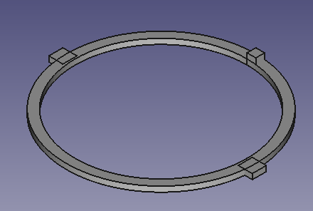
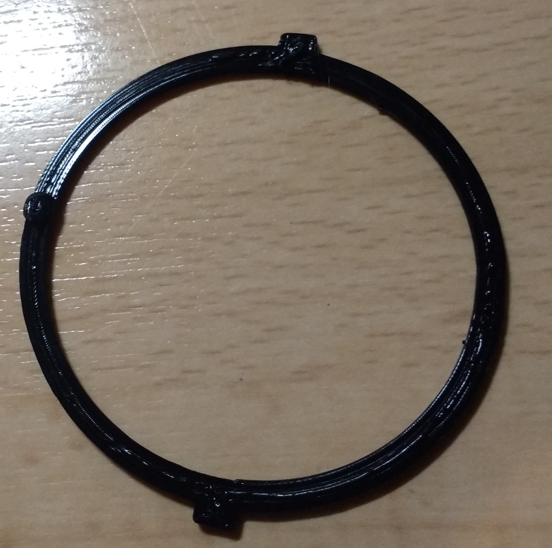
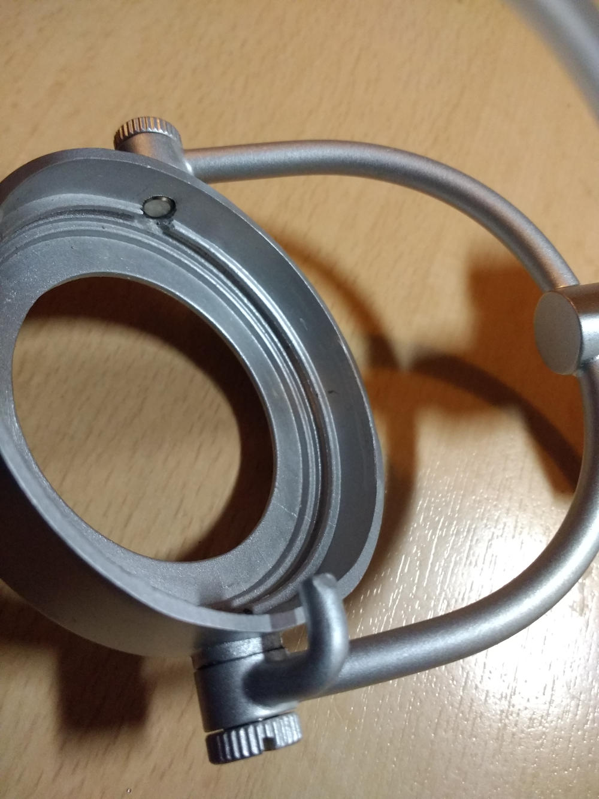
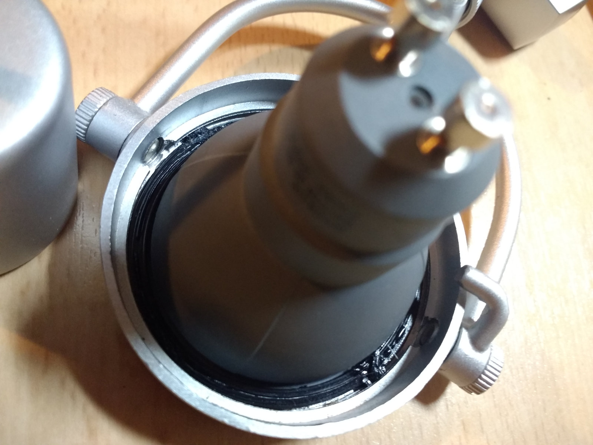

# Fix Paulmann URail Spot Ring ESL mounting

Paulmann URail is a configurable system for ceiling lamps.
Spot Ring ESL is a lamp out of the URail collection.

By default the ESL blub is mounted through a special wire, which is kind-of error prone.
Especially if you exchange the ESL blub with a GU10 LED blub, the original wire-mount does not work reliably anymore.

I present an alternative way of mounting the bulb to the lamp frame with a small 3d-printed ring.

## Usage
- Download STL file, slice it, print it on a 3d printer. I made it solid (it is just 1.5mm high), used 0.2mm layer height and used PLA material.
- Slide 3d printed ring over GU10 bulb
- Put GU10 bulb with ring into the lamp frame. The bulges of the ring go the counterpart of the lamp frame.
- Use a scredriver to move the bulges under the solid part, so that the ring is fixed.

## Adapt the model
I'm not sure if the ring fits all GU10 bulbs or all versions of the Spot Ring ESL lamp. If it does not work for you, feel free to adapt the 3d model.
I used FreeCAD to create the model.

## Pictures

